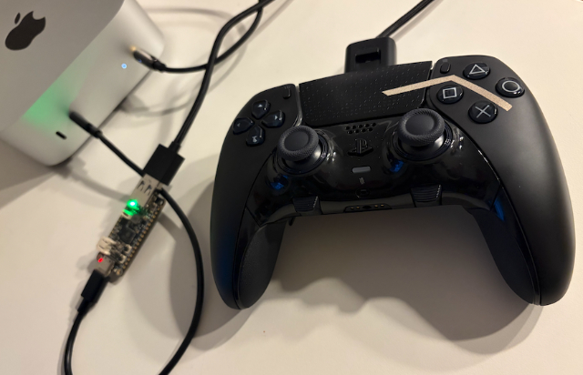

# DualSense Gyro Mouse Profile

This repository contains a HID Remapper profile for turning a Sony DualSense
controller into a gyro mouse setup.

The goal is to make a DualSense feel closer to a mouse-and-keyboard style FPS
layout, with gyro aiming for mouse movement and stick-based directional input.
In spirit, it is trying to recreate the feel of the FPS WASD profile from
Alpakka by Input Labs, but on a DualSense. You can think of it as a kind of
"Dualpakka" approach, a community term also used in posts such as:
https://www.reddit.com/r/GyroGaming/comments/1jx147j/my_dualpakka/

At the moment, the exported JSON profile is based on the DualSense Edge. The
main logic can be adapted further, but the current custom usages and profile
layout were built around that device first.

## What It Does

- maps gyro movement to mouse movement
- activates gyro when the touchpad is touched
- uses expression-based logic for gyro shaping and stick classification
- includes stick-driven directional outputs inspired by Alpakka-style controls

## Current State

This is an experimental profile setup rather than a polished end-user release.
It is a working base for testing, tuning, and iterating on a DualSense gyro
mouse layout.

Some parts are already organized into reusable expression files:

- [expression_1_gyro.txt](./expressions/expression_1_gyro.txt)
- [expression_1_gyro_calibration.txt](./expressions/expression_1_gyro_calibration.txt)
- [expression_2_left_sticks_4dir_inner_outer.txt](./expressions/expression_2_left_sticks_4dir_inner_outer.txt)
- [expression_3_right_stick_8dir.txt](./expressions/expression_3_right_stick_8dir.txt)
- [expression_4_fn_scrolling.txt](./expressions/expression_4_fn_scrolling.txt)

The current exported profile file is:

- [ds-edge-hid-remapper-config.json](./profiles/ds-edge-hid-remapper-config.json)

The exported JSON should be understood as a solid base configuration for
further tuning, not as a fixed final setup. If needed, individual expressions
can be swapped out without rebuilding the whole profile logic. For example,
there is an alternative gyro expression with auto-calibration and residual
drift filtering:

- [expression_1_gyro_calibration.txt](./expressions/expression_1_gyro_calibration.txt)

There is also a dedicated Fn button scrolling expression for the DualSense Edge
front function buttons:

- [expression_4_fn_scrolling.txt](./expressions/expression_4_fn_scrolling.txt)

## Current Mapping

The current JSON profile maps the DualSense Edge inputs as follows:

| Input | Output | Notes |
| --- | --- | --- |
| Gyro | Mouse X / Mouse Y | via expression-based gyro mouse logic |
| Left stick | `W` / `A` / `S` / `D` | via 4-direction stick expression |
| Left stick inner ring | `L` | via left stick ring detection |
| D-pad | Arrow keys | up/down/left/right |
| Cross / Circle / Square / Triangle | `R` / `F` / `V` / `T` | face button cluster |
| `L1` / `R1` | `Q` / `E` | shoulder buttons |
| `L2` / `R2` | Right mouse / Left mouse | trigger buttons |
| Create / Options | `Tab` / `Esc` | menu buttons |
| L3 / R3 | `J` / `0` | stick press buttons |
| Touchpad Click | `M` | touch contact itself is used separately for gyro activation |
| PS button | `Enter` | system button |
| Mute button | `F12` | microphone mute button |
| Back paddles | `Left Shift` / `Space` | DualSense Edge rear buttons |
| Right stick 8 directions | `1` to `8` | via 8-direction stick expression |
| Fn buttons | Vertical scroll | via dedicated Fn scroll expression |

## HID Remapper

This profile depends directly on the HID Remapper project by Jacek Fedorynski.
HID Remapper is the hardware and firmware layer that makes this kind of setup
possible: it can remap HID inputs in hardware, expose custom usages, run
expressions, and save the resulting configuration to the device itself.

Useful project links:

- HID Remapper website: https://www.remapper.org/
- HID Remapper manual: https://www.remapper.org/manual/
- HID Remapper configuration tool: https://www.remapper.org/config/
- HID Remapper forum: https://forum.remapper.org/
- Project discussion thread: https://forum.remapper.org/t/dualsense-edge-as-mouse-keyboard-with-gyro-touch-activation/278
- HID Remapper GitHub repository: https://github.com/jfedor2/hid-remapper

## Inspiration

This work is inspired by the Alpakka firmware and control ideas from Input
Labs:

- Alpakka overview: https://inputlabs.io/alpakka
- Alpakka profiles: https://inputlabs.io/alpakka/manual/profiles
- Alpakka FAQ, including touch-activated gyro behavior: https://inputlabs.io/alpakka/manual/faq
- Community examples of the "Dualpakka" idea:
  https://www.reddit.com/r/GyroGaming/comments/1jx147j/my_dualpakka/
  https://www.reddit.com/r/GyroGaming/comments/1p67nhh/taking_the_dualpakka_one_step_further/

The intention is not to copy it one-to-one, but to bring a similar control
philosophy to the DualSense through HID Remapper.

## Notes

- the current JSON profile targets the DualSense Edge first
- some logic may also work on the regular DualSense with adjusted device IDs
- tuning values such as sensitivity, deadzones, and stick thresholds are still
  meant to be adjusted to personal preference

## Purpose

This repository is mainly meant as a practical profile project:

- to experiment with gyro-to-mouse remapping on DualSense
- to document the related HID Remapper expressions
- to move toward a comfortable FPS-style controller layout with touch-activated
  gyro aiming

## My Hardware Setup

- DualSense Edge
- Adafruit Feather RP2040 with USB Host, Type A (5723),
- Mac mini M4
